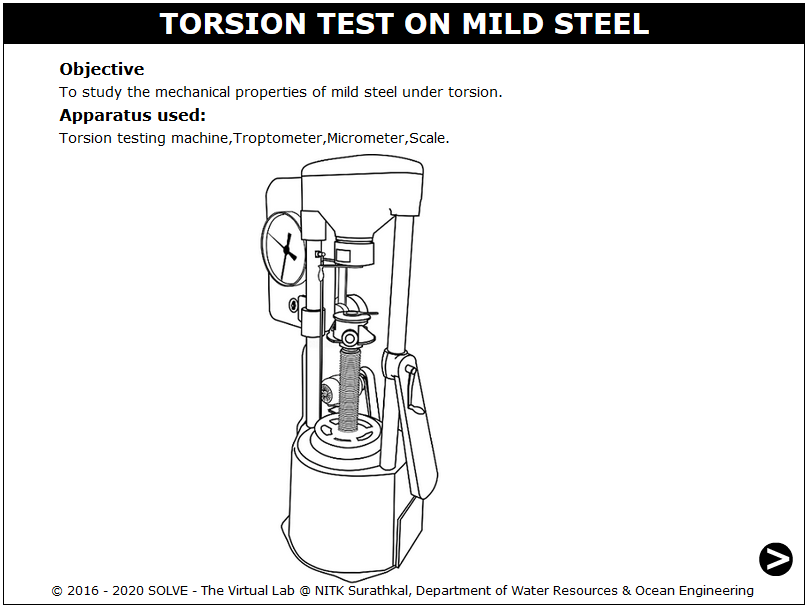
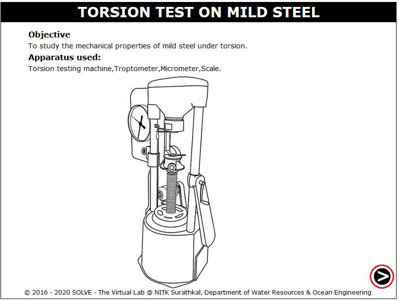
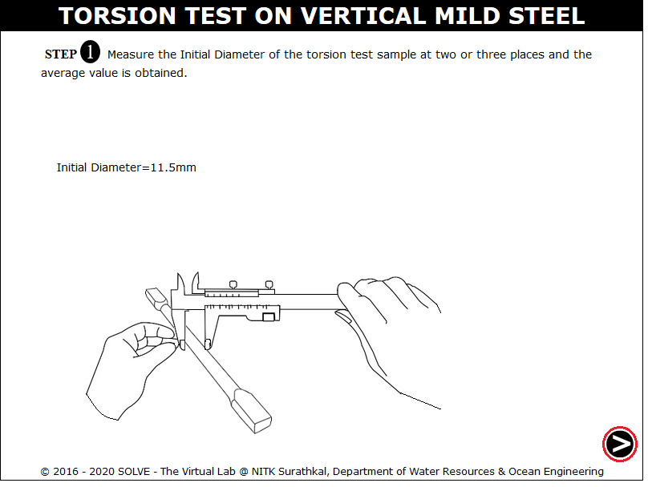
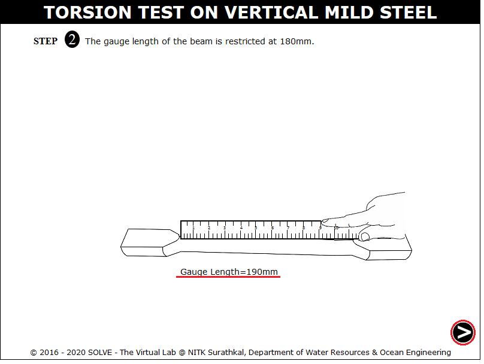
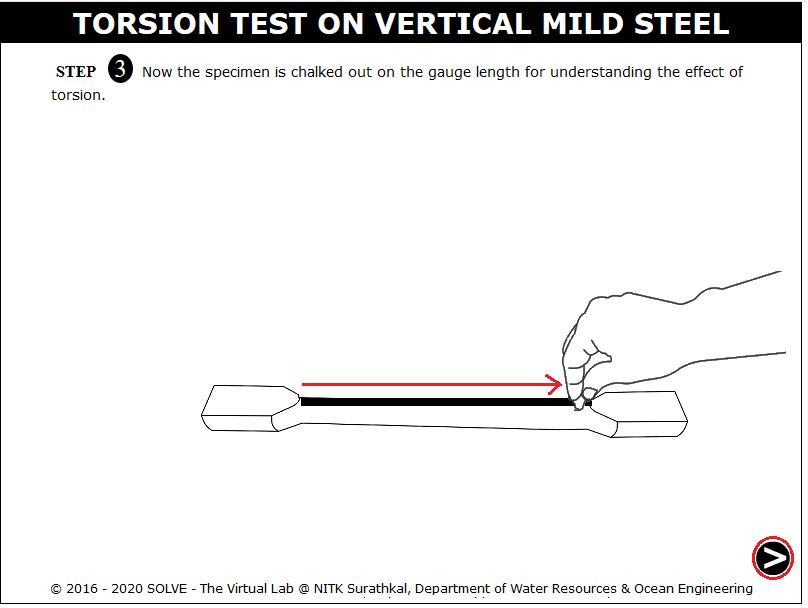
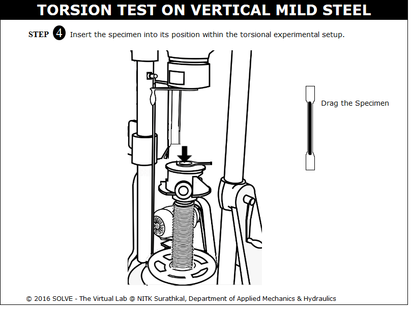
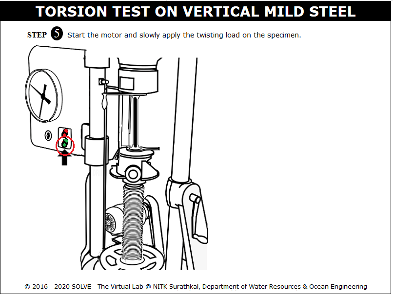
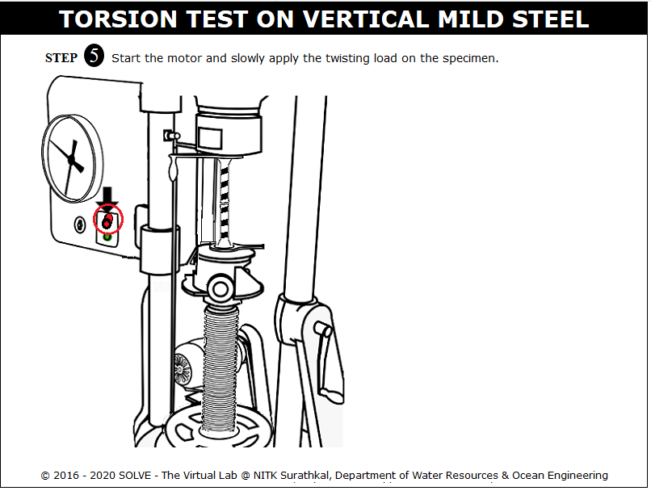
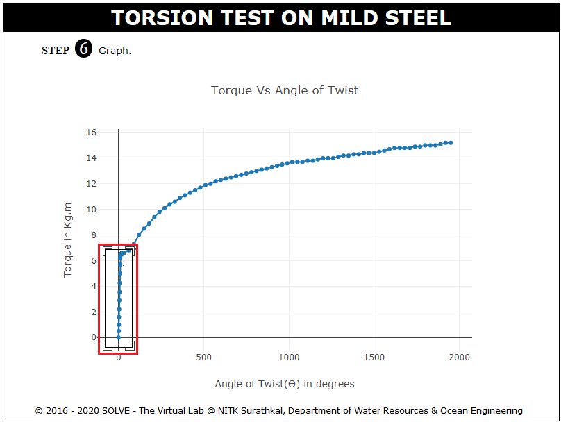
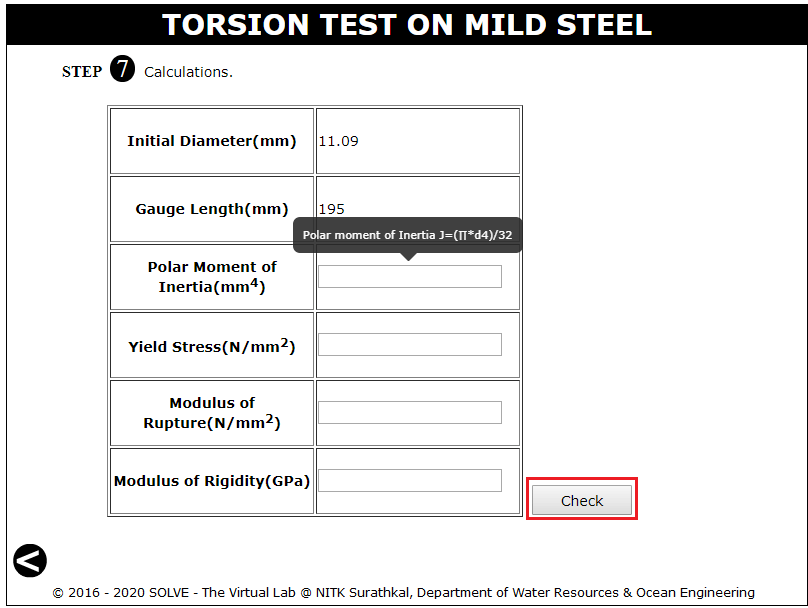

**OBJECTIVE**:

To study the mechanical properties of mild steel under torsion.

**STEPS**:

1. Click on the Torsion test on Vertical Mild Steel file, a window will open as shown.  
   

2. Click on the NEXT button to move to the next step.  
   

3. Click on vernier calliper to measure the diameter of the specimen.  
   

4. Click on measuring scale to measure the Length of the specimen between the grips.  
   

5. Click on hand with chalk to mark a straight line between the gauge length on the specimen.  
   

6. Specimen is dragged exactly to position where the arrow is pointing.  
   

7. Click on Green button to ON the motor, the experiment starts and the specimen starts rotating.  
   

8. Click on the RED button to stop the motor.  
   

9. Graph is obtained, clck on the highlighted area to view the slope drawn to the plot.  
   

10. Slope of the graph is obtained , then click NEXT button to move for calculation.  
    

11. Enter the calculated value and then click on Check to get the actual test result.  
    
