

In torsion testing the circular bar is placed in the machine such a way that its longitudinal axis coincides with the axis of the grips and so that it remains straight during the test. Then rotate one grip at a reasonable constant speed until the test piece breaks, here the shearing stresses will develop in any cross section of the bar whose value increases linearly from zero at the centre to a maximum at the outer periphery. Troptometer is used to measure the twist to an accuracy of one minute.

[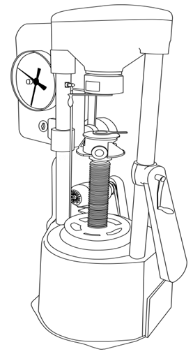](./images/torsion1.png)

Torsion testing machine

[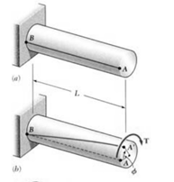](./images/torsion16.png)
[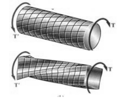](./images/torsion2.png)

**TYPES OF TORSION TESTS**:

Types of torsion testing vary from product to product but can usually be classified as:

i. Axial-Torsion: Applying both axial (tension or compression) and torsional forces to the test specimen.  
ii. Torsion Only: Applying only torsional loads to the test specimen  
iii. Failure Testing: Twisting the product, component, or specimen until failure. Failure can be classified as either a physical break or a kink/defect in the specimen.  
iv. Proof Testing: Applying a torsional load and holding this torque load for a fixed amount of time.

Consider now the solid circular shaft of radius 'R' subjected to a torque 'T' at one end, the other end being fixed under the action of this torque. The length of the shaft is L. Imagine a horizontal radial line drawn on the end face. When the end is twisted the line rotates through an angle &theta;. The length of the arc produced is R&theta;

[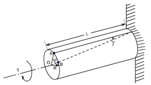](./images/torsion3.png)

Now consider a line drawn along the length of the shaft. When twisted the lines moves through an angle ϒ. The length of the arc produced is Lϒ.

If we assume that the two arcs are the same it follows that Rϴ= Lϒ

Hence by equating Lϒ= Rϴ, we get [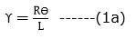](./images/torsion4.png)

The relation between shear strain and shear stress is [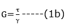](./images/torsion5.png)

𝜏 is the shear stress and G the modulus of rigidity. G is one of the elastic constants of a material. The equation is only true so long as the material remains elastic.

Substituting (1a) into (1b) we get [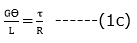](./images/torsion6.png)

Since the derivation could be applied to any radius, it follows that shear stress is directly proportional to radius ‘r’ and is a maximum on the surface.

Equation (1c) could be written as[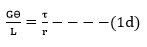](./images/torsion7.png)

Now lets consider how the applied torque ‘T’ is balanced by the internal stress of the material. Consider a elementary ring of material with shear stress 𝜏 acting on it at radius r.

[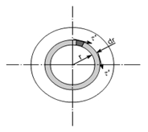](./images/torsion8.png)

Force acts at a radius r then the torque produced is

[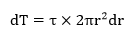](./images/torsion9.png)

Since [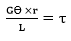](./images/torsion10.png) from equation (1d) then

[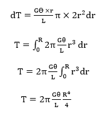](./images/torsion11.png)

Now substituting [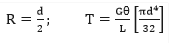](./images/torsion12.png)

Then,

[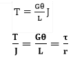](./images/torsion13.png)

The assumptions made while deriving the above relation are:

1. Material is homogenous.
2. Circular section remains circular and do not warp.
3. A plane section of a material perpendicular to its longitudinal axis remains plane and does not warp after the torque is applied.
4. Shaft is loaded by a couple or torque in a plane perpendicular to the longitudinal axis of the plane.
5. Shear stress is proportional to shear strain; it means that Hook's Law is applicable.
6. In circular shafts subjected to torque shearing strain varies linearly.

**Failure patterns in torsion**:

[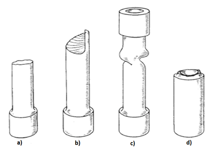](./images/torsion14.png)

(Source: http://up.persianscript.ir/uploads/13452737931.pdf)

a. Solid ductile metal bars (mild steel): Ductile torsion failure reveals a flat, transverse break having smooth shear surface and microvoid formation. The failure occurs along a plane perpendicular to the axis, in this plane the principal stress will be maximum.

b. Solid brittle metal bars: The crack propagates on a helical plane. The fracture surface roughness increases with distance of propagation, crack propagation rate, and decreased strength level. 45-degree helicoidal fracture will take place.

c. Ductile metal tube-failure by buckling.

d. Brittle metal tube

**Evaluation of fractures occurring during simple torsion test**:

[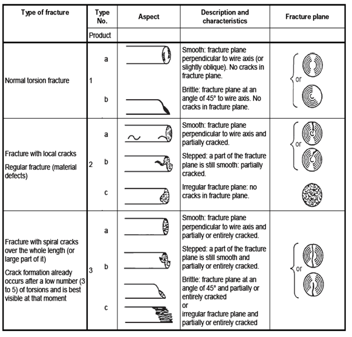](./images/torsion15.png)

(Source : Annex c, IS 1717:2012- Method of simple torsion testing of wire, Third Revision,2012)

**RELEVANT INDIAN STANDARD FOR TORSION TEST**:

1. IS 1717 (2012): Metallic Materials - Wire - Simple Torsion Test, Third Revision, 2012
